# NOVO AGENTE: Guia Fundamental do ParreiraLog

Olá, novo agente (ou desenvolvedor)! Se você está lendo isso, assumiu o desenvolvimento contínuo da plataforma **ParreiraLog** (ou Parreira Plataforma). Este documento é a **espinha dorsal** do projeto. Leia-o atentamente para compreender a estrutura, os padrões de integração e, principalmente, as regras rigorosas de atualização antes de modificar o código.

---

## 1. Visão Geral e Arquitetura

O sistema é uma **Plataforma Web Multi-Modular e Multi-Tenant** desenvolvida para gestão logística e empresarial.

*   **Frontend**: Single Page Applications (SPAs) híbridas. Utilizamos tecnologias web padrão (Vanilla JS, HTML5, CSS3) sem frameworks pesados (como React ou Vue). O foco é máxima performance, leveza e facilidade de manutenção.
*   **Backend / Banco de Dados**: Google Firebase.
    *   **Autenticação**: Firebase Auth.
    *   **Banco de Dados**: Firestore (NoSQL). Rigorosamente estruturado para abrigar múltiplos clientes (Tenants) em uma única instância, garantindo o isolamento total dos dados.
*   **Estratégia Local-First**: O sistema faz uso intenso de `localStorage`. Ele sincroniza os dados da nuvem para o navegador, opera de forma performática (e até offline dependendo do módulo), e depois sincroniza as atualizações de volta para o Firestore.

---

## 2. Estrutura de Diretórios (`/platform`)

A arquitetura moderna reside na pasta `/platform`. (A antiga subpasta `/web` ainda existe como fallback legado).

*   `platform/index.html`: Portal principal. É a tela de login e o Hub centralizador (Dashboard Principal) de onde o usuário navega para os módulos.
*   `platform/shared/` (e `/core/`): Contém CSS global, scripts compartilhados de sessão, controle de tenants, logout e identidade visual.
*   `platform/modules/`: Onde a mágica acontece. Cada módulo é um "micro-frontend" isolado com seu próprio `index.html`, `css/` e `js/`:
    *   **master**: Gestão global da plataforma (criação de tenants e super-usuários). Acesso exclusivo de administradores globais.
    *   **dispatch**: Módulo de Despacho Logístico (a evolução do sistema legado).
    *   **erp**: Sistema Integrado de Gestão Empresarial (Faturamento, Vendas, Financeiro, CRM, RH).
    *   **sales-force**: Força de Vendas Mobile (PWA para RCA em campo, offline-first com IndexedDB).
    *   **wms**: Warehouse Management System (Gestão de Armazéns).
    *   **wms-coletor**: Versão do WMS estritamente otimizada para coletores móveis (Zebra/Android) utilizados na operação de piso.

> ⚠️ **IMPORTANTE — Ambiente de Desenvolvimento Canônico (desde 2026-06-17):**
> O diretório `OneDrive\Área de Trabalho\TESTE` foi **descontinuado** como ambiente de trabalho.
> Todo desenvolvimento do módulo Dispatch deve ser feito **exclusivamente** em:
> `C:\Users\Paulo H Parreira\.gemini\antigravity\scratch\platform\modules\dispatch\`
> O deploy é feito pelo script `scratch\deploy.ps1`. O TESTE é mantido apenas como histórico.


---

## 3. Padrões de Integração e Construção

*   **Isolamento Multi-Tenant**: É a **regra de segurança número 1**. Nenhuma query no Firestore deve ser feita sem referenciar o `/tenants/{tenant_id}/...`. O acesso aos dados cruza sempre a validação da sessão do usuário.
*   **Acoplamento Fraco (Adapter Pattern)**: Os módulos não devem depender criticamente de arquivos uns dos outros. Para integrações, usamos o conceito de adaptadores. Exemplo: O módulo `wms` possui um arquivo `wms-integration.js` que age como tradutor entre o WMS e o ERP (sendo ele o Parreira ERP embutido, ou um provedor externo via API REST). O módulo `sales-force` usa os adapters `exportClientesParaFV()`, `exportEstoqueParaFV()` e `onErpReceberPedidoFV()` em `integracoes.js` para trocar dados com o ERP.
*   **Componentização Visual**: Reutilize classes e variáveis CSS (ex: `var(--primary-color)`) do escopo global. Crie interfaces modernas, intuitivas e responsivas.

---

## 4. Ecossistema e Fluxo de Integração (Diagrama Geral)

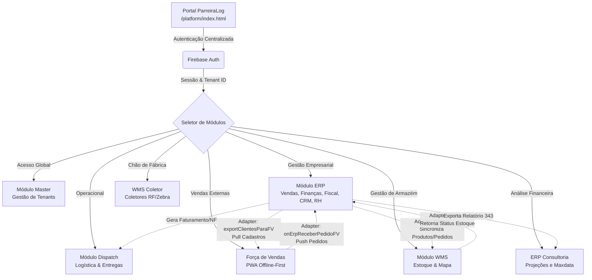

---

## 5. Árvores e POP (Procedimento Operacional Padrão) por Módulo

Abaixo está o detalhamento estrutural (ramificações) e os POPs de cada módulo. Os POPs são os guias passo-a-passo base para entender como cada fluxo funciona na prática.

### 5.1. Módulo Master (Administração Global)
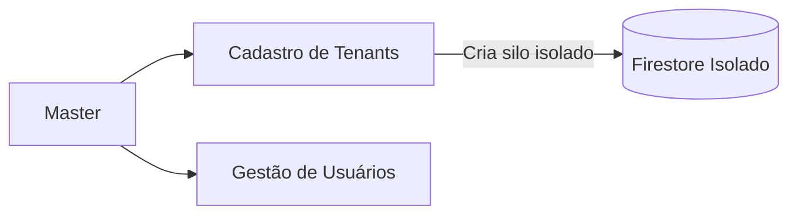
**POP (Procedimento Operacional Padrão):**
*   **Cadastro de Tenant:** O Admin acessa o Módulo Master -> Novo Cliente -> Define o 'slug' (ID único, ex. `ltdistribuidora`) -> Salva. O sistema gera as permissões e o silo de banco de dados exclusivo.
*   **Gestão de Usuários:** O Admin cadastra Novo Usuário -> Define Email/Senha -> Associa ao Tenant correspondente (ou 'parreira' se for acesso super-admin) -> Salva.

### 5.2. Módulo Dispatch (Logística & Entregas)
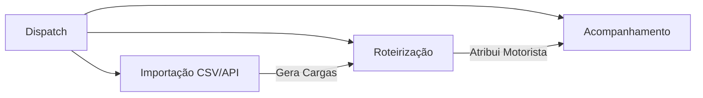
**POP (Procedimento Operacional Padrão):**
*   **Importação:** Operador exporta NF de ERP (ou recebe via API) -> Importa arquivo (ex. CSV) -> Mapeia campos (NF, Cliente, Endereço, Volumes) -> Transfere para painel local.
*   **Roteirização:** Operador seleciona NFs pendentes no dashboard -> Agrupa por região ou rota logística -> Atribui ao veículo/Motorista/Transportadora -> Emite Romaneio de Carga.
*   **Baixa e Ocorrências:** Motorista informa status -> Operador altera status para 'Entregue' (dispara Webhook/Sync) ou registra ocorrência (ex: "Destinatário Ausente", que reabre processo para reentrega).

### 5.3. Módulo ERP (Gestão Empresarial)
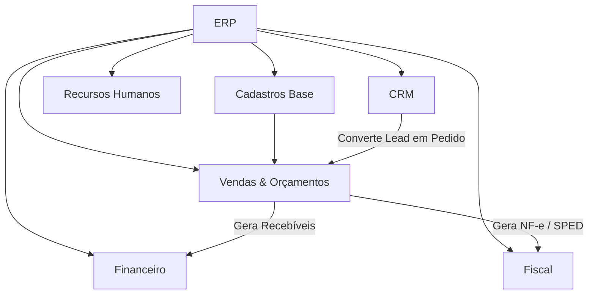
**POP (Procedimento Operacional Padrão):**
*   **Cadastros Base:** Inserir e atualizar Clientes, Fornecedores, Produtos (SKU, NCM, Preço Base de Custo) e Vendedores/Comissões.
*   **Vendas & Orçamentos (Fase 4):** Vendedor abre nova tela de Orçamento -> Adiciona Itens (aplicando Tabelas de Preços Regionais) -> Envia ao cliente. Cliente aprovando -> Converte para Pedido de Venda. Se houver limite estourado, cai em "Liberação de Crédito" para o gestor aprovar.
*   **Financeiro (Fase 5):** Pedido faturado gera título em "Contas a Receber". Compras geram "Contas a Pagar". Executa-se rotina diária de Conciliação Bancária, emissão de boletos e análise de inadimplência (ERP Consultoria Projetado).
*   **Fiscal/Faturamento (Fase 6):** Faturamento libera impressão do DANFE (NF-e) via SEFAZ. Ao fim do período, gera extração do SPED Fiscal e Contribuições. Dashboard (Fase 7) exibe KPIs (Margem, Curva ABC).
*   **CRM (Fase 10):** Pipeline Kanban de Oportunidades (Prospecção → Qualificação → Proposta → Negociação → Fechamento). Leads ganhos são convertidos automaticamente em Clientes e Orçamentos no ERP.
*   **RH (Fase 11):** Controle de Ponto Eletrônico, Folha de Pagamento (Holerite com deduções INSS/VT), Gestão de Férias e Licenças.

### 5.4. Módulo WMS (Warehouse Management System)
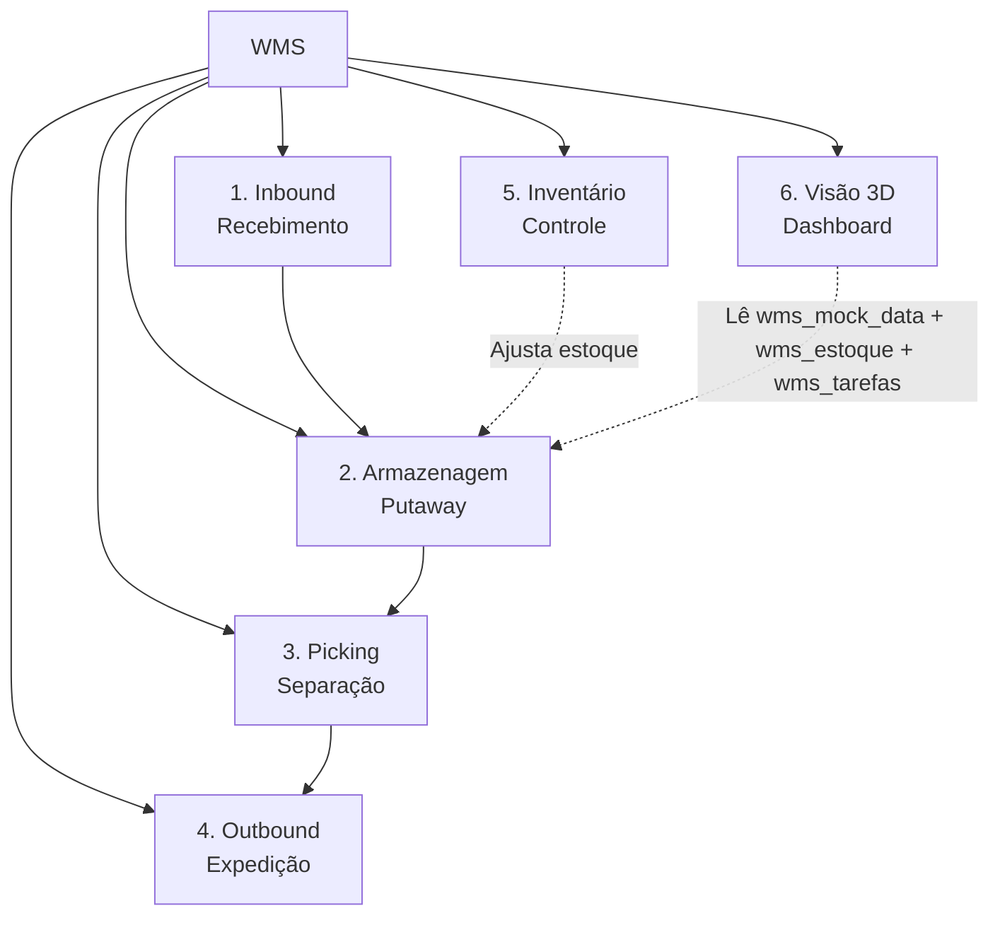
**POP (Procedimento Operacional Padrão):**
*   **1. Inbound (Recebimento):** Operador bipa a **chave NF-e (44 dígitos)** na tela de scanner → sistema chama `proc_buscar_nf_destinada` consultando todos os CNPJs do tenant no ERP. Se localizada, abre **Card de Conferência** auto-preenchido com dados do ERP (fornecedor, itens, volumes, transportadora). O operador preenche campos manuais (doca, placa, motorista, volumes físicos, condição da carga, email do fornecedor). Em caso de divergência → registra tipo, fotos da avaria (até 4 imagens) e envia relatório automaticamente ao fornecedor (`proc_enviar_email_divergencia`). Se NF não encontrada → nega ou libera entrada avulsa via **PIN de supervisor** configurável (Configurações → Integrações → Segurança), com log de auditoria obrigatório.
*   **2. Armazenagem (Putaway):** Motorista de empilhadeira/operador lê as tarefas. O sistema sugere endereço visual vazio ou onde já tem o SKU -> Operador move -> Confirma operação no app Web.
*   **3. Picking (Separação):** Gera "Ondas de Separação" agrupadas por prioridade/Rota (integração Dispatch). Operador visualiza caminho otimizado no Mapa Visual -> Vai ao endereço -> Coleta SKU -> Leva à área de `packing`/consolidação.
*   **4. Outbound (Expedição):** Última conferência na caixa -> Fecha volume -> Imprime etiqueta logística de transporte -> Despacha.
*   **5. Inventário:** Supervisor agenda bloqueio contábil parcial ou total -> Operadores bipam endereços e atualizam as contagens -> Supervisor aprova distorções -> Sistema consolida estoque novo no ERP parceiro.
*   **6. Visão 3D (Dashboard):** Tela principal com visualizador Three.js usando **InstancedMesh** para renderizar até 12.349+ endereços em 3 draw calls. Layout: predios ímpares à esquerda do corredor, pares à direita. Cada `posicao` ocupa um slot Z independente. Células coloridas por status (verde=livre, azul=ocupado, vermelho=desabastecido, amarelo=tarefa, cinza=bloqueado). Carregamento **manual** via botão para não travar a UI. Requer import de endereços em `/modules/wms/import-enderecos.html`.

**Armazenamento WMS:**
- `wms_mock_data_<tenant>`: Array de endereços (estrutura: `{id, rua, predio, nivel, posicao, apto, tipo, status}`)
- `wms_estoque_<tenant>`: Saldo de estoque por endereço
- `wms_tarefas_<tenant>`: Tarefas de movimentação pendentes
- `wms_armazem_config`: Config física global (corridorWidth, profundidade, posLargura, posAltura)
- `wms_cadastros_<tenant>`: Cadastros gerais incluindo `enderecoTipo` (tipos com dimensões físicas)

**Atenção:** A chave `wms_mock_data` (sem sufixo) é migrada automaticamente para `wms_mock_data_<tenant>` no startup do WMS (`wms-core.js`) para corrigir importações antigas.

### 5.5. Módulo WMS Coletor (Chão de Fábrica)
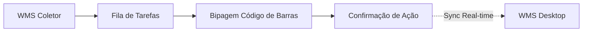
**POP (Procedimento Operacional Padrão):**
*   **Operação Mobile:** Operador loga com sua credencial no browser do coletor Zebra/Android (interface enxuta XXL) -> Acessa módulo desejado (Guarda, Contagem, Picking) -> Ouve o bip (leitura de código de barras ou manual via teclado) do endereço e produto -> Digita Quantidade -> Confirma. Alerta sonoro de acerto/erro avisa o ritmo da operação em real-time.

### 5.6. Módulo Força de Vendas / Sales Force (Vendas em Campo)
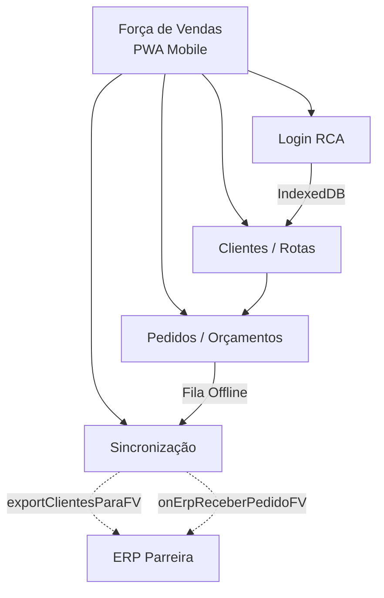
**POP (Procedimento Operacional Padrão):**
*   **Login:** RCA acessa o app pelo browser do celular (PWA instalável) -> Digita código e senha -> Sistema carrega dados do vendedor e sincroniza cadastros do ERP (Clientes, Produtos, Tabelas, Transportadoras).
*   **Vendas em Campo:** RCA seleciona o Cliente da rota -> Escolhe produtos e aplica desconto (limitado pelo máximo do vendedor/produto) -> Define condição de pagamento e transportadora -> Salva Pedido. Pedido entra na fila de sincronização.
*   **Sincronização:** Ao ficar online, o app transmite os pedidos para o ERP via adapter `onErpReceberPedidoFV()`, que converte o formato FV → ERP, puxa cadastros atualizados via `exportClientesParaFV()`, e atualiza estoque via `exportEstoqueParaFV()`.

### 5.7. Integração Profunda ERP ↔ WMS (Fase 9)
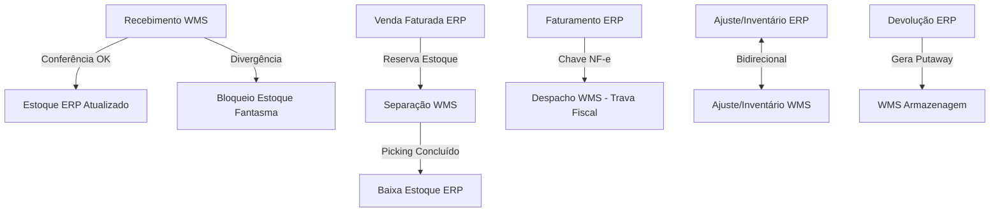
**POP:**
*   **Recebimento:** WMS bipa chave NF-e → `proc_buscar_nf_destinada` (multi-CNPJ) → Conferência física no card → `proc_confirmar_recebimento` atualiza estoque ERP. Se divergente → `proc_registrar_divergencia` bloqueia unidades e `proc_enviar_email_divergencia` notifica o setor de Compras e o fornecedor automaticamente.
*   **Separação:** ERP fatura venda -> Reserva estoque -> Gera Ordem de Separação no WMS -> Operador separa -> WMS confirma -> ERP dá baixa efetiva.
*   **Trava Fiscal:** Veículo só é liberado para despacho no WMS se todos os pedidos vinculados possuírem Chave de NF-e faturada no ERP.
*   **Ajustes Bidirecionais:** Ajustes manuais e inventários de um sistema refletem automaticamente no outro.
*   **Devoluções:** Estorno no ERP gera tarefa de `putaway` pendente no WMS.

### 5.8. Módulo CRM — Gestão de Relacionamento (Fase 10)
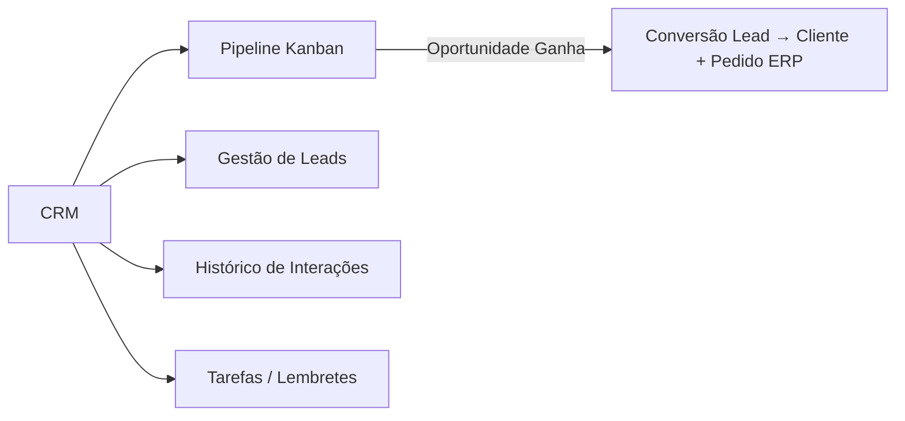
**POP:**
*   **Pipeline:** Vendedor abre o Funil -> Cria Oportunidade com valor estimado -> Arrasta entre fases (Prospecção → Qualificação → Proposta → Negociação → Fechamento).
*   **Conversão:** Ao marcar como "Ganho", o CRM cadastra automaticamente o prospect como Cliente no ERP e gera um Orçamento no módulo de Vendas.

### 5.9. Módulo RH — Recursos Humanos (Fase 11)
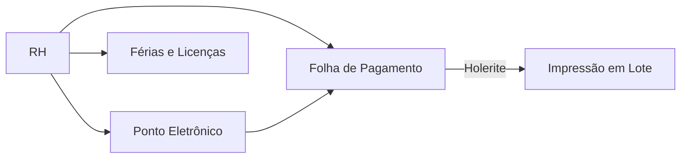
**POP:**
*   **Ponto Eletrônico:** Funcionário acessa RH > Ponto -> Clica "Bater Ponto" -> Sistema registra Entrada/Saída com data/hora e geolocalização (mock).
*   **Folha de Pagamento:** Gestor acessa RH > Holerites -> Visualiza grid de funcionários com Salário Base, deduções (INSS 10%, VT 6%) e Líquido a Receber -> Gera Holeite individual via modal de impressão.
*   **Férias e Licenças:** RH agenda afastamento -> Define tipo (Férias/Licença) e período -> Status exibido em blocos coloridos (Programado, Em Andamento, Concluído).

### 5.10. Módulo Financeiro ERP Consultoria (Standalone/PWA)
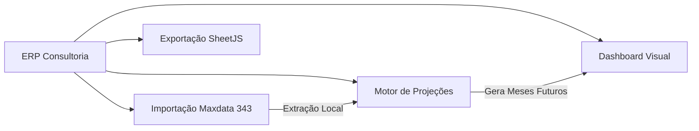
**POP:**
*   **Acesso e Seleção (Multi-tenant):** Usuário acessa o módulo e seleciona/cria o cliente desejado na tela inicial.
*   **Calibração (uma vez por cliente):** Usuário acessa "Importar PDF" → clica em "Calibrar" → faz upload do PDF "834 - Fluxo de Caixa Mensal" (Janeiro a Maio) e do Excel (com abas JANEIRO, FEVEREIRO...). O motor `PdfMapper` detecta colunas por posição X no PDF, lê cada aba do Excel e compara valores: se o valor de qualquer mês bater → vínculo criado. Ao mapear 100%, clica em "🔒 Travar Mapeamento" → salvo permanentemente no Firestore.
*   **Importação de Dados Reais:** Após calibrado, usuário arrasta qualquer PDF 834 mensal → sistema aplica o mapeamento automaticamente e salva os valores por mês no Firestore.
*   **Projeções:** Usuário define premissa de crescimento (ex: 5% a.m). O sistema replica automaticamente a base dos dados reais para os meses futuros.
*   **Exportação:** Em "Exportar Excel", o módulo consolida todas as abas mensais com saldo e variação, e emite o arquivo original em padrão Contábil.

---

## 6. O Processo de Atualização e Deploy (REGRA DE OURO)

Nossa esteira de atualização tem um fluxo cravado em pedra para **evitar perda de dados e assegurar redundância**. Todas as vezes que um novo recurso for finalizado, seja uma correção ou grande fase de projeto, siga obrigatoriamente nesta ordem:

### Passo 1: Backup Preventivo em Camadas (ANTES de qualquer alteração)
**OBRIGATÓRIO antes de tocar em qualquer código.** Essa etapa garante que existe uma cópia de segurança íntegra do estado atual caso algo dê errado durante o desenvolvimento.

**Procedimento (rotação em camadas):**
1.  **Camada 2 ← Camada 1:** Copiar todo o conteúdo de `platform backup 1/` → para `platform backup 2/` (sobrescreve o backup mais antigo).
2.  **Camada 1 ← Produção:** Copiar todo o conteúdo de `platform/` (código atual/produção) → para `platform backup 1/`.

**Estrutura de pastas envolvidas (raiz do projeto):**
```
scratch/
├── platform/              ← Código atual (produção)
├── platform backup 1/     ← Backup recente (snapshot pré-alteração)
└── platform backup 2/     ← Backup mais antigo (segurança extra)
```

> ⚠️ **Nunca pule esta etapa.** Somente após confirmar que os backups foram concluídos com sucesso, inicie as modificações no código.

### Passo 2: Atualizar este documento (NOVO_AGENTE.md)
Se a sua implementação introduzir um novo módulo, mudar a arquitetura ou alterar algo base na estrutura, edite **primeiro** este arquivo para manter a "espinha dorsal" atualizada. (Você já fez isso para ver as árvores do sistema acima!).

### Passo 3: Executar e validar Melhorias
Garanta que as modificações foram testadas e estão funcionais localmente no projeto.

### Passo 4: Atualizar a Versão
Modifique o controle de versão do sistema. Atualize o arquivo `platform/version.json` (ou manifest/json do módulo modificado). Crie uma nova nota de `last_change`, suba o número principal da `version` e atualize a data e a `build`.

### Passo 5: Subir Deploy pelo Script de Backup (`deploy.ps1`)
Abra o terminal do PowerShell na raiz do projeto (`C:\Users\Paulo H Parreira\.gemini\antigravity\scratch`) e rode o comando:
```powershell
.\deploy.ps1
```

**O que o script faz por baixo dos panos?**
1.  **Backup em Camadas (redundância adicional):** Copia a versão antiga de segurança `backup 1` → para a pasta `backup 2`.
2.  Depois copia o código atual de produção `platform/` → para a pasta de segurança `backup 1`. (Faz o mesmo com o diretório web).
3.  **Controle de Versão Git:** Executa `git add .`, faz um commit com a data/hora exata do deploy, e sobe para o GitHub (`git push origin main`).
4.  **Deploy em Prod:** O Vercel escuta a master do Github e automaticamente constrói as URLs de produção assim que o script Ps1 termina.

> 💡 **Nota:** O Passo 5 (`deploy.ps1`) executa **seu próprio** backup em camadas internamente. Isso significa que o sistema possui **dupla proteção**: backup preventivo (Passo 1) antes de alterar, e backup de deploy (Passo 5) antes de publicar.

---

Bem-vindo ao desenvolvimento! Siga as diretrizes, respeite o processo de deploy em camadas, e vamos juntos evoluir a plataforma.

---

## 7. Histórico de Versões Relevantes

| Versão | Data | Mudanças Principais |
|---|---|---|
| **3.14.25** | 2026-06-24 | FIX CRÍTICO: Correção de roteamento do Vercel. Acesso direto a `/login.html` estava colidindo com o wildcard de tenant `/:tenant` e redirecionando incorretamente para o app de despacho, forçando a empresa `login.html` como padrão. Adicionado rewrite direto para `/login.html` no `vercel.json` e atualizado `reserved` segments em `app.js`. |
| **3.14.11** | 2026-06-20 | URGENTE FIX: Banner de homologação estava `display:flex` hardcoded em `index.html` → levado para produção a cada merge `staging→main`. Banner agora `display:none` por padrão e exibido SOMENTE quando `hostname` contém `'staging'` ou `'localhost'` via IIFE JS. Produção não exibe mais o banner amarelo. |
| **3.14.10** | 2026-06-20 | FIX CRÍTICO: fix_viopex `ruleHasRedesp` — regras com `percentualRedespacho>0` ou `minimoRedespacho>0` agora detectadas como "tem redespacho" mesmo quando dropdown=`Sem Redespacho`. Evita dupla contagem em rotas como DOM ELISEU (calcFreight já inclui redespacho via `percentualRedespacho=2.5%`, v3.14.9 adicionava `redespTotal` por cima). ULIANOPOLIS (sem `percentualRedespacho`) continua usando o path de preservação correto. |
| **3.14.9** | 2026-06-19 | FIX: fix_viopex redespacho — substitui "pular NF" por "recalcular frete principal + preservar redespTotal existente". Quando dispatch tem `redespTotal > 0` mas regra atual sem redespacho: `newTotal = calcFreight(regra) + redespTotal_preservado`. Aplica mínimo corretamente e evita mainTotal negativo. Preview mostra badge 🔄 nas linhas com redespacho preservado. |
| **3.14.8** | 2026-06-19 | FIX CRÍTICO RAIZ: `freight_tables` nunca era sincronizado com Firestore ao salvar/importar regras — app usava só `Utils.saveRaw` (localStorage). `fix_viopex` lia sempre o Firestore desatualizado (regras com `minimo=0`). AGORA: após salvar regra individual e após importação em lote, `Utils.Cloud.save('freight_tables', rules)` garante sync imediato com Firestore — fix_viopex passa a enxergar os valores corretos de mínimo, excedente etc. |
| **3.14.7** | 2026-06-19 | FIX: fix_viopex — guarda de redespacho: NFs com `redespTotal > 0` mas regra atual sem redespacho são puladas no recálculo (evita `mainTotal` negativo). Preview exibe grupo vermelho "🔴 CONFLITO REDESPACHO" listando cada NF afetada com valor do redespacho atual — requerem correção manual ou atualização da regra de frete. |
| **3.14.6** | 2026-06-19 | FIX RAIZ: Importador Excel de Tabelas de Frete — `colMap` agora detecta múltiplas variações de cabeçalho: `Min.`/`Mín.`/`Frete Min`/`Vlr Min` → `minimo`; `Vir Exc.`/`Vir Kg`/`Vlr Exc` → `valorExcedente`; `Lim. Peso`/`Lim Peso` → `limitePeso`. Adiciona aviso em toast quando colunas críticas não são detectadas (causa raiz do recálculo com mínimo=0). |
| **3.14.5** | 2026-06-19 | FEAT: fix_viopex — botão "Forçar Sync → App" aparece quando preview encontra 0 alterações (valores já corretos em `dispatches_db` mas `legacy_store` stale). Copia registros da carrier de `dispatches_db` → `legacy_store`, dispara `onSnapshot` no app e atualiza a Conferência de Fatura automaticamente. |
| **3.14.4** | 2026-06-19 | FIX CRÍTICO: fix_viopex — após salvar em `dispatches_db`, agora também atualiza `legacy_store/dispatches`. O `onSnapshot` do app só escutava `dispatches_db` com `status='Pendente Despacho'`; NFs `Despachado` não chegavam ao listener → localStorage stale → Conferência de Fatura exibia valores antigos. Com o sync do `legacy_store` o app recebe e aplica a atualização automaticamente sem recarregar a página. |
| **3.14.3** | 2026-06-19 | FEAT: Conferência de Fatura — atalho Enter nos filtros: se apenas 1 NF estiver visível após o filtro, Enter a seleciona automaticamente, limpa o campo e mantém foco para busca contínua. Campo pisca amarelo se houver ambiguidade (mais de 1 resultado). |
| **3.14.2** | 2026-06-19 | FEAT: Conferência de Fatura — NFs selecionadas sobem automaticamente para o topo com destaque verde e borda lateral; separador visual mostra quantas NFs ainda estão disponíveis. Funciona por seleção individual e no "selecionar todas". |
| **3.14.1** | 2026-06-19 | FIX: Importação de tabela de frete — `firstLine is not defined` (variável removida junto com bloco duplicado na refatoração do suporte a Excel v3.14.0). |
| **3.14.0** | 2026-06-19 | FEAT: Importação de tabela de frete aceita Excel (.xlsx/.xls) além de CSV — usa XLSX.read via ArrayBuffer. FIX: fix_viopex agora atualiza `mainTotal` além de `total` (Conferência de Fatura priorizava mainTotal, causando valores antigos). FIX: Painel /admin — `<base href="/platform/admin/">` corrigido para carregar admin.js corretamente via Vercel rewrite. TOOL: /fix_clients — ferramenta de migração de clientes entre tenants com suporte a dados chunked. |
| **3.13.0** | 2026-06-19 | FEAT: Login sem campo ID da Empresa — tenant detectado automaticamente pela URL (/ltdistribuidora). Rota dinâmica `/:tenant` no vercel.json serve qualquer empresa pela URL. FEAT: Painel Super-Admin `/admin` — gestão centralizada de tenants, módulos e usuários. FIX: Clientes ltdistribuidora migrados via /fix_clients (dados em chunks não migravam automaticamente). |
| **3.12.0** | 2026-06-17 | SEGURANÇA & QUALIDADE: firestore.rules APLICADO via Firebase Console (bloqueia all por padrão, libera apenas request.auth != null por tenant — ATIVO EM PRODUÇÃO); CSP headers completos no vercel.json (X-Frame-Options, HSTS, Referrer-Policy, Permissions-Policy, Content-Security-Policy); core/js/security-guard.js (Guard.requireAuth/requireRole/requireMasterAccess + SecureLogger suprime console.* em prod); Master module protegido com Guard.requireMasterAccess(); portal: credenciais hardcoded removidas do FALLBACK_USERS; acontec-integration.js: apiToken migrado de localStorage para sessionStorage. |
| **3.11.70** | 2026-06-17 | refactor: TESTE descontinuado. Migração de todos os arquivos exclusivos (etiquetas, leitor, read_files.ps1) para platform/modules/dispatch. Dispatch é agora a única fonte da verdade para o módulo de despacho. |
| **3.11.69** | 2026-06-17 | fix DEFINITIVO: loadAll() salva dados do Firestore DIRETO no localStorage, bypassando Anti-Echo (60s). Anti-Echo era o bloqueador: impedia carga de transportadoras após login quando havia escrita local recente. Anti-Echo permanece ativo apenas nos listeners onSnapshot em tempo real. |
| **3.11.63** | 2026-06-16 | fix CRÍTICO: Cadastros de transportadoras sumindo — loadAll() usa processIncomingData() com Anti-Echo; Anti-Rollback impede nuvem vazia ([]) de apagar dados locais e auto-heala Firestore |
| **3.11.62** | 2026-06-16 | fix: Conferência de Fatura não mostrava NFs de redespacho legado (campo d.redespacho) para transportadora de redespacho (ex: RA TRANSPORTES); suporte a NFs antigas sem redespCarrier |
| **3.11.61** | 2026-06-16 | fix CRÍTICO: App travando em '⏳ Sincronizando...' para sempre — Cloud.loadAll() na init agora tem timeout de 8s e _appReady=true garantido no finally |
| **3.11.60** | 2026-06-16 | (1) Estorno fatura: fix SYNC BLOQUEADO — dispatches no localStorage direto; (2) Login: loadUsersForTenant com retry automático 3×1s |
| **3.11.59** | 2026-06-15 | Dispatch: fix botão de login travado em '⏳ Carregando...' — handler envolvido em try/catch/finally garante restauração do botão em qualquer cenário; timeout de 10s no Cloud.loadAll() do login evita travamento por Firebase lento |
| **3.11.58** | 2026-06-15 | Dispatch: fix login — _doDispatchLogin registrado imediatamente (antes do await Cloud.loadAll) para evitar timeout do timer de 3s; handler real em _doDispatchLoginReal; catch exibe erro visual no botão e libera _appReady |
| **3.11.57** | 2026-06-15 | Dispatch: fix TypeError — Object.keys(carrierConfigs) proteção contra null/undefined quando getStorage retorna null para chave inexistente |
| **3.11.56** | 2026-06-13 | Dispatch: fix Recálculo Retroativo TNORTE — regras e configs re-lidas do storage no momento do cálculo, evitando falha quando Firestore ainda não terminou de carregar no init |
| **3.11.55** | 2026-06-12 | Dispatch: card Recálculo Retroativo TNORTE agora aparece em Configurações (view-app-settings). Antes estava somente em Cadastro Transportadora |
| **3.11.54** | 2026-06-12 | Dispatch: fix transportadora RA — helper _carrierMatch com normalização de espaços (replace /\s+/g) resolve visibilidade de NFs da VIOPEX despachadas com redespacho 'R A TRANSPORTES' |
| **3.11.53** | 2026-06-12 | Dispatch: remoção de logs de diagnóstico [DIAG-RA] de utils.js após resolução do bug de visibilidade |
| **3.11.52** | 2026-06-12 | Dispatch: log de diagnóstico [DIAG-RA] para investigar NFs de abril da RA que não aparecem na conferência de fatura |
| **3.11.51** | 2026-06-12 | Dispatch: fix transportadora RA — NFs de abril com status legado 'concluido' no Firestore agora aparecem na conferência. Normalização em getFullDispatchesHistory + VALID_STATUSES/VALID_STATUSES_FILTER atualizados |

| **11.23.28** | 2026-06-20 | ERP Consultoria: Troca do relatório Maxdata de 343 → **834 (Fluxo de Caixa Mensal)**. Novo pdf-parser.js com detecção dinâmica de colunas por posição X (jan/fev/mar/abr/mai). Motor de calibração multi-mês: compara valor de cada conta do PDF com coluna C de cada aba do Excel (JANEIRO, FEVEREIRO...) — primeiro mês que bate gera vínculo permanente. Botão "🔒 Travar Mapeamento" aparece quando todas as contas estão vinculadas. Fix deploy: script `deploy.ps1` commitava em `staging` sem merge em `main` — adicionado merge manual staging→main antes do push. Fix `consolidateFCViews` usa `reduce` (último com `view-header-bar`) em vez de `find` (primeiro), garantindo que a UI nova de calibração seja exibida. |
| **11.23.27** | 2026-06-20 | ERP Consultoria: Calibração PDF×Excel por valor (motor PdfMapper v1), UI de calibração no view-fc-import com seção Configurar Vínculo Automático. SheetJS adicionado. Fix consolidateFCViews: usa reduce para pegar último view-header-bar. Fix deploy pipeline staging→main. |
| **11.23.9** | 2026-05-27 | ERP Consultoria: Prioridade absoluta do valor manual sobre PDF nos grupos 1/2/3/7; 'Custo de Aquisição' adicionado ao MANUAL_GROUPS restaurando campos de entrada das contas 2.x |
| **11.23.8** | 2026-05-27 | ERP Consultoria: Seção 3 (Custo) reposicionada antes das contas de custo; matching PDF/Excel por código exato (aliases removidos); edição inline de códigos desativada; botão Auto-Vincular sempre visível; dropdown Grupo corrigido no modal de vinculação |
| **11.23.4** | 2026-05-25 | ERP Consultoria: Excel parser seleciona automaticamente a aba correspondente ao período do dashboard (ex: MARÇO, MAR, 03) |
| **11.23.3** | 2026-05-25 | ERP Consultoria: Vinculação agora mapeia códigos do PDF como aliases (apelidos) das contas reestruturadas no Plano de Contas, preservando o código personalizado do relatório |
| **11.23.2** | 2026-05-25 | ERP Consultoria: Limpeza automática de pontos e espaços iniciais/finais das descrições das contas no Plano de Contas para exibição limpa e exatidão ao encontrar/vincular lançamentos |
| **11.23.1** | 2026-05-25 | ERP Consultoria: Tratamento de booleanos (Verd/Fals) na extração do Excel para evitar contaminação do Plano de Contas |
| **11.23.0** | 2026-05-25 | ERP Consultoria: Auto-Vincular via Excel reescrito — parser por coluna (sem falsos matches), dropdown completo do MASTER_ACCOUNTS no modal, UPDATE correto do código existente, debug no console |
| **11.22.0** | 2026-05-20 | ERP Consultoria: financial-engine v6 (subheaders automáticos, MANUAL_GROUPS), editor Plano de Contas drag-and-drop, filtros Mensal/Trimestral/Semestral/Anual, conferência PDF vs. manual, fix cache Vercel |
| **11.20.0** | 2026-05-16 | WMS — Campos de endereço atualizados (DEPOSITO, AREA, EQUIPAMENTO, OPERACAO, PRODUTO VINCULADO, CAPACIDADE) |
| **11.14.0** | 2026-05-12 | WMS Coletor: Conferência integrada — endereço real ABC, sync Firestore, atualização de estoque e status de endereço no putaway |
| **11.13.0** | 2026-05-12 | WMS: Motor de Armazenagem (Putaway) — algoritmo ABC/Curva, sugestão inteligente de endereços, integração Firestore |
| **11.12.0** | 2026-05-12 | WMS: Firebase Sync de Endereços — Firestore fonte da verdade, localStorage cache, write-through, badge Cloud Sync |
| **11.11.0** | 2026-05-12 | WMS: cfg-galpao — Configuração Física do Galpão com preview Canvas interativo |
| **11.10.0** | 2026-05-12 | WMS 3D com InstancedMesh, tipos de endereço com dimensões físicas, migração automática de tenant, dashboard corrigido |
| **11.9.2** | 2026-04-21 | Correção do parser de PDF (ERP Consultoria/Maxdata) |
| **11.9.x** | 2026-04 | Módulo WMS: inbound com conferência em 3 etapas (Portaria, Receber, Conferência), contagem cega com PIN |
| **11.8.x** | 2026-03 | Dispatch: ferramenta de arquivamento, faixa de status offline/Firebase, sync pendente |

> ✅ **Compromisso do agente:** A partir da v11.10.0, este documento é atualizado a cada deploy junto com o `version.json`. A versão é **por plataforma** (não por módulo). A cada entrega, o agente informa a versão no formato `📦 Deploy — vX.Y.Z`.
